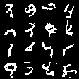

# seqtree

This is a set of experiments in using decision tree ensembles to model sequences, such as text and images (which are sequences of pixels).

**Disclaimer:** this is raw research code, and it has changed a lot as I discovered what worked and what did not. As a result, it is not suitable to be used in a finished product. It is intended to be used simply to demonstrate some ideas (many of which did not work).

## Samples

Here is a sample of digits generated by the `enc_mnist` experiment, which uses clustering to create a latent space and then models sequences in this latent space using decision trees:

Here is a sample of digits generated by the `sliding_mnist` experiment, where the same ensemble is used to predict every pixel, conditioned on the previous ones:

## What worked

The best results I got were with the `enc_mnist` experiment. This experiment used a form of sparse dictionary learning based on clustering and gradient boosting. I believe this is a novel algorithm, as I have not found it in existing literature. The decision tree aspect of the algorithm seemed to have less of an effect on the results than the quality of the latent codes learned via clustering.

Since my cluster/boost algorithm was so successful, I want to head more in this direction and stop trying so hard to use decision trees. It would be nice to be able to build arbitrary function approximators in the same way I built an encoder/decoder with cluster/boost. Ideally, it would also be possible to stack multiple cluster/boost encoders on top of each other to get an even better representation.

Another thing which definitely improved tree quality was a polynomial-based splitting heuristic. I approximated each leaf's loss function as a 9th degree polynomial (using a Taylor series), and used the sums of these polynomials to efficiently compute the optimal performance achieved from each leaf node. This is a higher-order approximation than the second-order approximations used in XGBoost (which I also support in my code), and it did result in more powerful trees.

## What did not work

Most of the ideas I tried did not pan out well. Here is a list of some of them, and a summary of the results:

 * Feature cascades: each leaf in a tree corresponds to a new binary feature which can be used later in the ensemble. The goal was to be able to build and reuse abstract features. I tried this both for text generation and MNIST modeling, and it did not boost learning; it did, however, greatly reduce runtime performance, since the tree search had to check more and more features.
 * Ensemble "sliding": this is somewhat akin to convolution in neural networks. Let's say we are trying to predict the pixel at (x, y). Then features of the form (i, j) can refer to (x+i, y+j). This way, we can use the same ensemble for every pixel of every image. This is implemented in both the `relative_mnist` and `sliding_mnist` experiments (in slightly different ways). Results look blocky and skewed, and are often incoherent.
 * Logical OR in decision branches: with this technique, we can use multiple features in each decision branch. I call this using a "union" of features. Unions are greedily selected, meaning that the first feature in the union already has to be the best single feature; then more features are tacked on greedily in order to improve split quality. This did boost the performance of initial trees in most cases, but it didn't improve final performance, nor did it help in the text generation case where I hoped it would be the most effective.

## More on cluster/boosting

This is an encoding scheme that turns images into a discrete sequence of latent codes, where each latent code is a number between 0 and N-1. In my experiments, N=16 was suitable. Higher values of N can fit data better, at the cost of overfitting more.

The basically algorithm is as follows. First, cluster the data into N clusters. Approximate every sample as its nearest cluster center c. The index of the closest center is the first element of the latent code. Now cluster the data set of residuals, (x-c), and find the set of second centers c1. The index of these second centers is the second element of the latent code. Now cluster (x-c-c1), etc.
